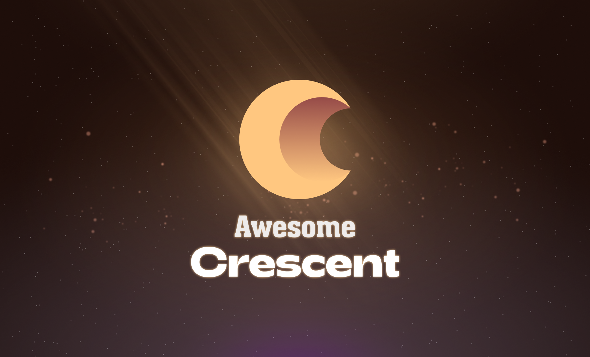

	

# Awesome Crescent 

A curated list of awesome resources, libraries, documents, and tools related to the <a href='https://crescent.network'>Crescent Network</a> blockchain.

 
## Contents

1. [Official](#Official)
2. [Documentation](#Documentation)
3. [Tutorials](#Tutorials)
4. [Social](#Social)
5. [Misc](#Misc)
6. [Contributing](#Contributing)

## Official

* [Crescent Network](https://crescent.network) - The official website of the project.
* [Crescent Core](https://github.com/crescent-network/crescent) - The official github repository for the project. It contains the core modules and tools.
* [Crescent DEX](https://app.crescent.network/) - The official web application interface to interact with Crescent DEX.

## Documentation

* [Crescent Docs](https://docs.crescent.network/introduction/what-is-crescent)
* [Developer Docs](https://github.com/crescent-network/crescent/tree/main/docs)

## Tutorials

* [CLI](https://github.com/crescent-network/crescent/tree/main/docs/cli) - How to interact with the Crescent blockchain using command-line interface.
* [API](https://github.com/crescent-network/crescent/tree/main/docs/api) - How to start interacting with the blockchain using APIs.

## Social

* [Blog](https://crescentnetwork.medium.com)
* [Discord](https://discord.com/invite/ZUfrDnSX8G)
* [Telegram](https://t.me/crescentnetwork)
* [Twitter](https://twitter.com/CrescentHub)

## Contributing

Your contributions are always welcome! Please read the [Contribution Guidelines](https://github.com/crescent-network/awesome-crescent/blob/master/CONTRIBUTING.md) first.